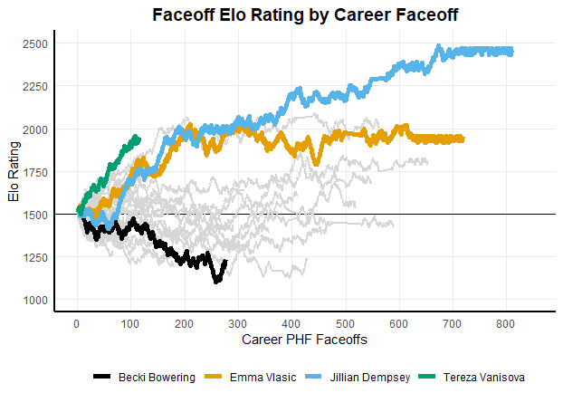

```{r setup, include=FALSE}
knitr::opts_chunk$set(echo = TRUE)

require(fastRhockey)
require(tidyverse)
```

# Introduction               

The data landscape around the Premier Hockey Federation (PHF), formerly the National Women's Hockey League (NWHL) has been uneven and rocky. The league itself has almost continuously undergone changes year-to-year, which have been reflected in its data.              

At times, there have been scrapers and packages intended to create access to PHF data, which at times, was detailed enough to include the location data of various events. However, with the transition from the NWHL to PHF, and the accompanying website changes, that API access and detail of data was lost and previous scrapers were broken.          

`fastRhockey` was developed to recreate access to PHF data given those changes. As the PHF grows, with games being played on ESPN, it is crucial that there is a publicly (and easily) available data source for both team and public analysts.                

While the data that is tracked and provided through the API that `fastRhockey` accesses is not always consistent and clean thanks to extraneous factors on the PHF side of things, `fastRhockey` is a women's hockey R package created for the long haul and to be maintained as the PHF grows and the demand for women's hockey data continues to grow.                 

In addition to the PHF data and functions available through `fastRhockey`, functions to access the NHL API are available through `fastRhockey`. The following paper will briefly discuss the NHL API access and functions, but they were not the primary motivation for creating the `fastRhockey` paper.               

[`fastRhockey` can be found on GitHub in its own repository](https://github.com/sportsdataverse/fastRhockey) as well as downloaded from CRAN using `install.packages("fastRhockey")`. 

# Structure of fastRhockey             

`fastRhockey` was developed entirely as an R package that pulls live data while additionally storing the data in a `fastRhockey-data` repository. `fastRhockey` contains a multitude of functions, but the ones that return actionable data being with either the `phf_` or `load_` prefix.                                    

Additionally, the package contains plenty of helper and additional functions that are designed to work with the data and to parse it into actionable play-by-play data. Many of the functions begin with the `process_phf...` prefix and are designed to clean and prepare the data in the wrapper functions that one uses to pull the data. While the code for these functions was written as part of the `fastRhockey` package, they are not necessary or expected to be used by anyone doing PHF analysis.                                 

The functions that `fastRhockey` is dependent on are common R packages, for example, `rvest` and `jsonlite` are relied upon for accessing the API and parsing the returned data, as well as the `stringr` package, used for the parsing of text play-by-play data. 

# Installing fastRhockey                 

`fastRhockey` has been submitted to CRAN and can be downloaded from CRAN using the following method:

```r
install.packages("fastRhockey")
```

Additionally, the development branch of the package can be downloaded using `devtools` if one prefers that method:

```r
if (!requireNamespace('devtools', quietly = TRUE)){
  install.packages('devtools')
}
devtools::install_github(repo = "sportsdataverse/fastRhockey")
```

## Data Source               

The [PHF](https://www.premierhockeyfederation.com/) API is accessible with an API Key that can be set for each individual person using the `getOption` function from `base R`. A unique API key can be found through the  PHF website if one is curious, but it has not caused any issues yet.                

## Analysis                  

Given the way that `fastRhockey` was set up and developed, an aspiring analyst can start at the very beginning of their questions and use the data returned from each function in subsequent functions.            

Let's start with finding the clinching game of the 2022 Isobel Cup to explore the functionality of `fastRhockey`. An exploration begins with the `phf_schedule()` function, which takes a season input as an argument.               

```{r}
phf_schedule(season = 2022) %>%
  dplyr::filter(game_type == 'Playoffs') %>%
  dplyr::filter(home_team == 'Connecticut Whale' &
                  away_team == 'Boston Pride') %>%
  dplyr::select(game_id, date_group, facility, attendance, 
                home_team, away_team, 
                home_score, away_score,
                winner)
```

Most notably, we're able to extract the `game_id` of the game, as well as the important data from the game, namely the winner and teams involved. The returned dataframe contains plenty more columns, most of which are metadata and ID columns.

```{r}
phf_schedule(season = 2021) %>%
  colnames()
```

Now we know that the Boston Pride defeated the Connecticut Whale by a score of 4-2 on March 28th, 2022 at AdventHealth Center Ice for the Isobel Cup title, where the `game_id = 514869`.            

Let's take that game ID and look at how the two teams fared statistically.                 

```{r}
phf_team_box(game_id = 514869) %>%
  dplyr::select(team, winner, total_scoring, total_shots,
                successful_power_play, penalty_minutes,
                faceoff_percent, period_1_scoring,
                period_2_scoring, period_3_scoring)
```

A very quick query and we have the story of the game. Boston won the game by turning on the jets in the third period, scoring three of their four goals in the final period.             

The Pride additionally won more faceoffs than the Whale; [prior women's hockey research](https://hockey-graphs.com/2021/04/14/how-important-are-faceoffs-to-possession-in-womens-hockey/) has indicated that winning faceoffs  in the women's game has a more profound impact on winning than in the men's game. While the detailed location data may no longer be available, `fastRhockey` allows for further exploration of research questions like the above.                    

In addition to team box scores, `fastRhockey` returns player box score-level data, for both skaters and goalies.

```{r}
phf_player_box(game_id = 514869)$skaters
```

```{r}
phf_player_box(game_id = 514869)$goalies
```

One potential public usage of this data is creating the opportunity to play fantasy PHF hockey using these stats.            

However, the most notable return of `fastRhockey` is the play-by-play and event-level data that can be extracted from the `phf_pbp()` function. The function returns about 78 columns of data, anywhere from metadata about an event to the player involved, or the players on the ice in the event of a goal.                               

```{r}
phf_pbp(game_id = 514869)
```

The combination of this play-by-play data and the player box scores has facilitated further women's hockey faceoff research, specifically regarding the usage of ELO Ratings to evaluate players in faceoff situations.                 

```{r, include=TRUE, echo=FALSE, out.width="67%", fig.cap="Rolling ELO Faceoff Ratings for the PHF.", fig.align='center'}

```

The above graph shows rolling ELO ratings by career faceoff across the PHF/NWHL. Using the idea of ELO ratings, this approach compares skater wins against their level of competition and assigns value to each won or lost faceoff.                       

The play-by-play data returned by `phf_pbp()` allows for these rolling ELO ratings where the ratings are calculated by subsequent faceoffs, ensuring that the faceoff ratings are always up to date when they're calculated, even within an individual game.           

# NHL Data and Capabilities                                 

`fastRhockey` was integrated with `hockeyR` to add NHL capabilities and functions to the `fastRhockey` package as a part of the SportsDataverse. The NHL data available through `fastRhockey` is quite expansive, covering all aspects of the NHL with the following functions and more:                                 

- `nhl_teams`: metadata on the teams in the NHL
- `nhl_game_boxscore`: NHL boxscore data on a game level
- `nhl_game_shifts`: returns NHL shift and time on ice data; there is no PHF equivalent for this data
- `nhl_player_stats`: stats on a player level in the NHL
  - `nhl_player_info`: contains player metadata for the NHL
- `nhl_schedule`: schedule data for the NHL
- `nhl_draft`: data for the NHL draft, specifically picks, prospects, and prospect info
  - `nhl_draft_prospects` and `nhl_draft_prospects_info` for various draft prospect information
- `nhl_team_logos`: returns data on the logos for the NHL teams; equivalent of `phf_team_logos`
- `load_nhl_pbp`: loading full seasons of NHL play-by-play data                       

The data and functions returned from the NHL capability of `fastRhockey` are impressive and cover a lot of ground, but were integrated from `hockeyR` and NHL capability was not the primary motivation for developing `fastRhockey`. However, it is a huge and important addition to incorporate the major hockey data sources under one package umbrella and turns `fastRhockey` into the go-to source for anyone looking to do any sort of hockey analysis.                      

# Conclusion                

`fastRhockey` was developed as an answer to the lack of consistent and publicly available women's hockey data for the Premier Hockey Federation (PHF). The PHF, and women's hockey in general, has been rapidly growing in popularity, and with that, comes a growing desire for numbers and stats about the PHF. `fastRhockey` is a reliable and consistent package that is designed to handle the irregularities and inconsistencies that are the norm with women's hockey data. The package contains additional NHL capabilities to consolidate major hockey stats under one package.                    

[`fastRhockey` can be found on GitHub and](https://github.com/sportsdataverse/fastRhockey) as well as CRAN, using `install.packages("fastRhockey")`.

